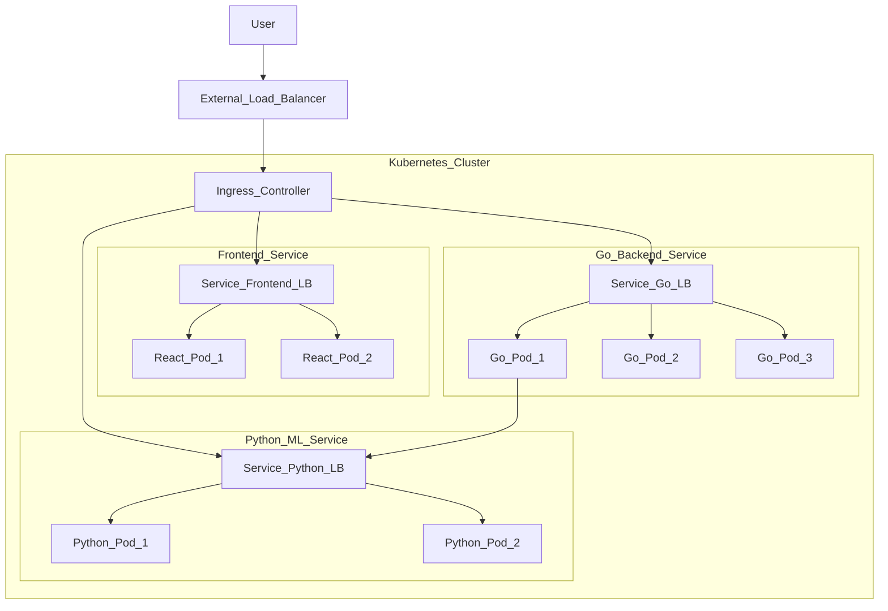

```mermaid
flowchart TD
    User --> ExtLB
    ExtLB[External_Load_Balancer] --> Ingress

    subgraph Kubernetes_Cluster
        Ingress[Ingress_Controller]

        Ingress --> SvcFrontend
        Ingress --> SvcGo
        Ingress --> SvcPython

        subgraph Frontend_Service
            SvcFrontend[Service_Frontend_LB] --> FE1[React_Pod_1]
            SvcFrontend --> FE2[React_Pod_2]
        end

        subgraph Go_Backend_Service
            SvcGo[Service_Go_LB] --> GO1[Go_Pod_1]
            SvcGo --> GO2[Go_Pod_2]
            SvcGo --> GO3[Go_Pod_3]
        end

        subgraph Python_ML_Service
            SvcPython[Service_Python_LB] --> PY1[Python_Pod_1]
            SvcPython --> PY2[Python_Pod_2]
        end
    end

    GO1 --> SvcPython
```

